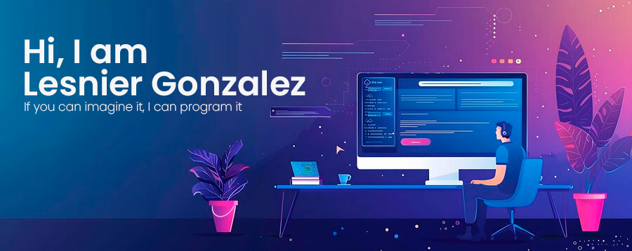
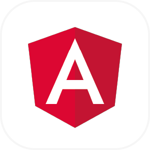
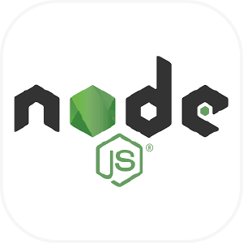

  <h1> Welcome 👋, to Lesnier's Github  </h1>  

 

 

 

  
   
  
  
  
  
  
   

 I am a Computer Engineer, Full Stack developer with extensive experience in creating robust and scalable web solutions. I value independence, effective communication, and teamwork.
Skilled in project management, leading teams to deliver efficient and scalable solutions. Let's build something great together!

  
<!--
**Lesnier/Lesnier** is a ✨ _special_ ✨ repository because its `README.md` (this file) appears on your GitHub profile.

Here are some ideas to get you started:

- 🔭 I’m currently working on ...
- 🌱 I’m currently learning ...
- 👯 I’m looking to collaborate on ...
- 🤔 I’m looking for help with ...
- 💬 Ask me about ...
- 📫 How to reach me: ...
- 😄 Pronouns: ...
- ⚡ Fun fact: ...
-->
