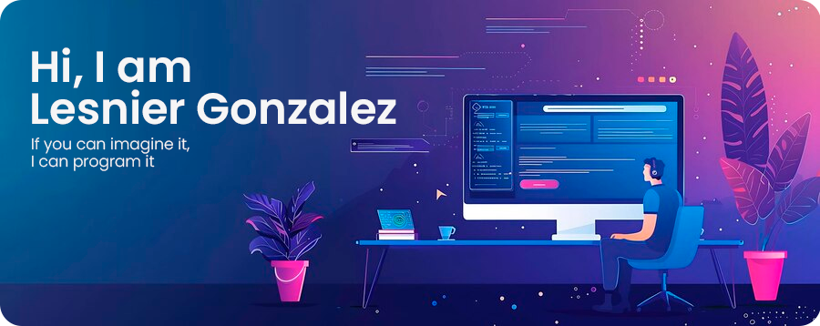
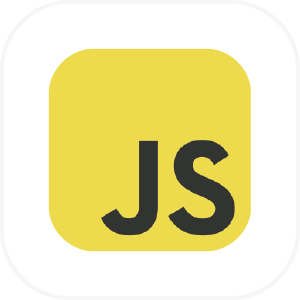
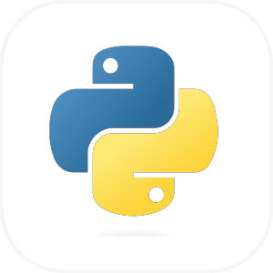
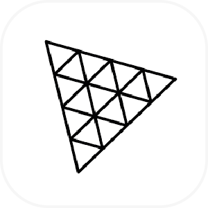
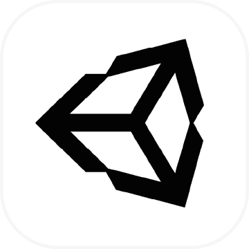
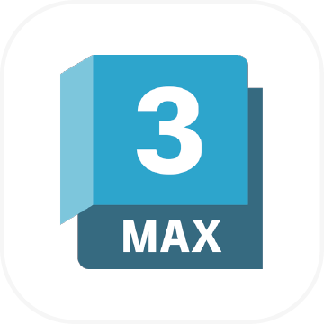
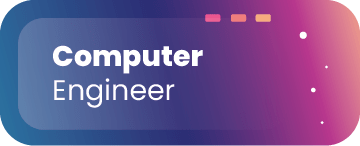
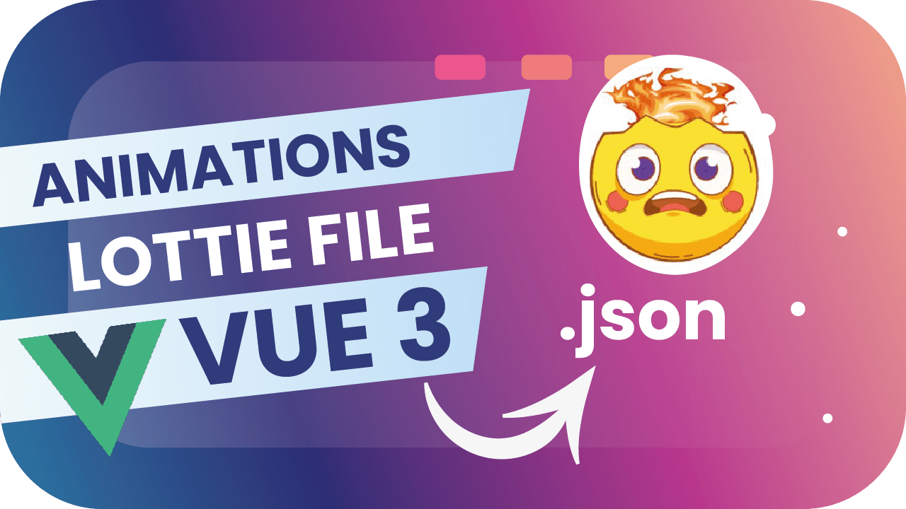
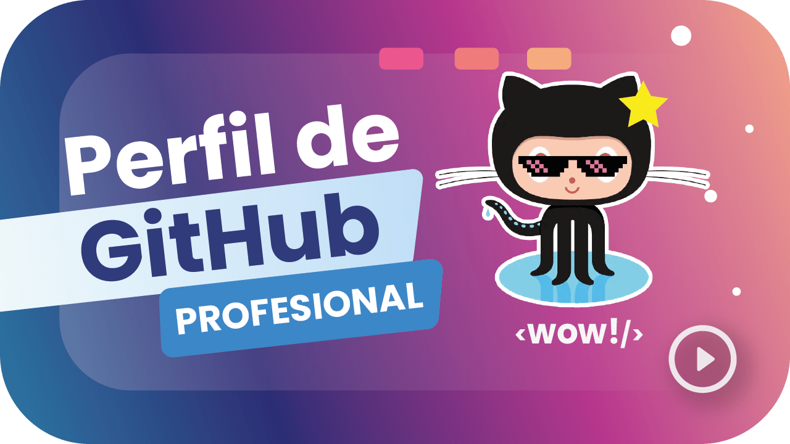

  <h1> Welcome 👋, to Lesnier's Github  </h1>  

 

 

 

  
   
  
  
  
  
  
  
  
  
  
  

I am a Computer Engineer 💻, Full Stack developer with extensive experience in creating robust and scalable web solutions 🌐. I value independence, effective communication 🗣️, and teamwork 🤝. Skilled in project management 📊, leading teams to deliver efficient and scalable solutions 🚀. Let's build something great together! 💪

  <h2>Education 🎓</h2>  

  
   
  

  <h2>Connect with me 📡</h2>  

		
	
		
	
	
 	
	

	
	&nbsp;&nbsp;
	

<!--
**Lesnier/Lesnier** is a ✨ _special_ ✨ repository because its `README.md` (this file) appears on your GitHub profile.

Here are some ideas to get you started:

- 🔭 I’m currently working on ...
- 🌱 I’m currently learning ...
- 👯 I’m looking to collaborate on ...
- 🤔 I’m looking for help with ...
- 💬 Ask me about ...
- 📫 How to reach me: ...
- 😄 Pronouns: ...
- ⚡ Fun fact: ...
-->
