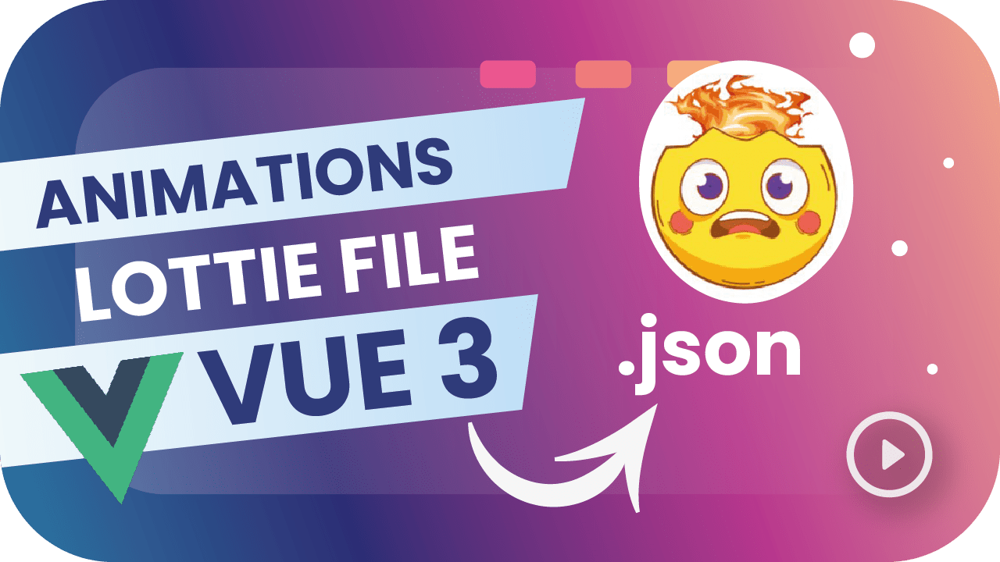

  <h1> Welcome 👋, to Lesnier's Github  </h1>  

 

 

 

  
   
  
  
  
  
  
  
  
  
  
  

<h2>Other Technogies and Tools</h2>

   
   
   
    
   
   
    
    
    
    
  
 

 

  <h2>Education 🎓</h2>  

  
   
  

 

I am a Computer Engineer 💻, Full Stack developer with extensive experience in creating robust and scalable web solutions 🌐. I value independence, effective communication 🗣️, and teamwork 🤝. Skilled in project management 📊, leading teams to deliver efficient and scalable solutions 🚀. Let's build something great together! 💪

 

  <h2>Connect with me 📡</h2>  

		
	
		
	
	
 	
	

 
 

	
	&nbsp;&nbsp;
	

 
 

- 🔭 Currently, I am reading a little about macroeconomics to better understand the factors that influence global markets.

- 🌱 In addition, I am immersed in learning application development using artificial intelligence and Web3 technologies, always seeking to be at the forefront of technological innovations.
- 👯 I am currently open to job opportunities: My CV

 
 
  <h2>My Articles 📰</h2>  

|  [Fourth Industrial Revolution](https://medium.com/@lesniergonzalez/the-impact-of-the-fourth-industrial-revolution-on-the-labor-market-opportunities-threats-and-e70e6318c0ce) |  [Vue.js vs Angular vs React](https://medium.com/@lesniergonzalez/battle-of-the-frontend-titans-vue-js-vs-angular-vs-react-c3987ade6b91) |  [Vue 3 — Route Map for Beginners](https://medium.com/@lesniergonzalez/vue-3-route-map-for-beginners-e9709b17f25e) |
| ---------------------------------------------------------------------------------------------------------------------------------------------------------------------------------------------------------------------------------------------------------------------------------- | ------------------------------------------------------------------------------------------------------------------------------------------------------------------------------------------------------------------------------------------- | ------------------------------------------------------------------------------------------------------------------------------------------------------------------------------------------------------------------------- |
| "The Fourth Industrial Revolution (4IR) is characterized by the fusion of digital, physical, and biological technologies, fundamentally altering the way we live, work, and interact..."                                                                                           | "Choosing the right frontend framework is crucial for developers and businesses alike. Vue.js, Angular, and React are three of the most popular choices, each with ..."                                                                     | "In this tutorial, we’ll delve deep into Vue.js’s core features, useful additional resources, the Pinia library for state management, as well as recommended influencers ..."                                             |
| [Lee más](https://medium.com/@lesniergonzalez/the-impact-of-the-fourth-industrial-revolution-on-the-labor-market-opportunities-threats-and-e70e6318c0ce)                                                                                                                           | [Lee más](https://medium.com/@lesniergonzalez/battle-of-the-frontend-titans-vue-js-vs-angular-vs-react-c3987ade6b91)                                                                                                                        | [Lee más](https://medium.com/@lesniergonzalez/vue-3-route-map-for-beginners-e9709b17f25e)                                                                                                                                 |

 
 

<!--
**Lesnier/Lesnier** is a ✨ _special_ ✨ repository because its `README.md` (this file) appears on your GitHub profile.
https://miro.medium.com/v2/1*IuwEKQZyeMg1Tz3iQQTi3w.jpeg
Here are some ideas to get you started:

- 🔭 I’m currently working on ...
- 🌱 I’m currently learning ...
- 👯 I’m looking to collaborate on ...
- 🤔 I’m looking for help with ...
- 💬 Ask me about ...
- 📫 How to reach me: ...
- 😄 Pronouns: ...
- ⚡ Fun fact: ... -->
